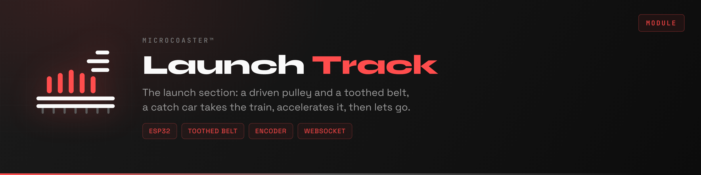
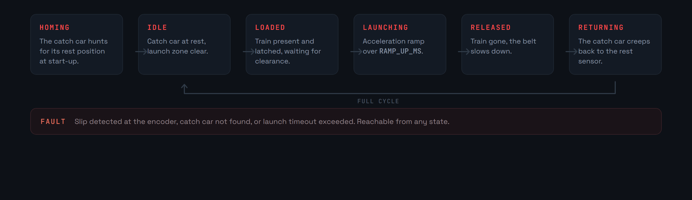
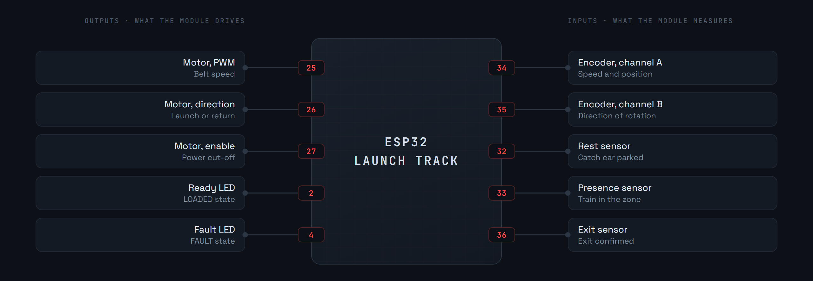
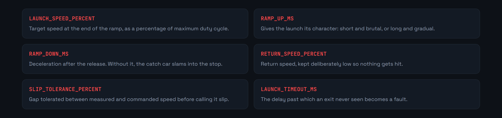

<div align="center">

<p>
  <a href="README.md"></a>
  
</p>



</div>

The launch section accelerates the train over a few tens of centimetres, instead of hauling it to the top of a hill. A motor drives a pulley, the pulley turns a toothed belt, and a catch car fixed to that belt takes hold of the train, carries it away while accelerating, then lets go.

The module drives that motor, measures the real belt speed at the encoder, and brings the catch car back to its rest position between two launches.

Like the other modules, it is configured on first boot through a captive portal, then joins the server over WebSocket.

**Version 0.1.0**


Everything turns on one question: is the catch car where we think it is, and is it really carrying the train?

An encoder on the pulley shaft answers both. It gives the belt speed, which is what lets the acceleration ramp be followed. And it gives the catch car's position along its travel, which is what lets it be brought back to rest after every launch.



The catch car does not slam back in reverse: the belt slows down over `RAMP_DOWN_MS`, then creeps back at `RETURN_SPEED_PERCENT` until the rest sensor.


**No launch is decided locally.** The module carries out an order from the controller, which alone knows whether the track downstream is clear.

**The catch car has to be at rest before a train is accepted.** If it is not, it will latch in the wrong place, or not at all. That is the whole reason for the `HOMING` state at start-up.

**Two timeouts bound the operation.** `LAUNCH_TIMEOUT_MS` declares a fault if the exit is never seen, `RETURN_TIMEOUT_MS` if the catch car never finds its rest position again.

**Slip cuts everything.** If the speed measured at the encoder drifts lastingly from the command by more than `SLIP_TOLERANCE_PERCENT`, the catch car is sliding along the train instead of carrying it. Pushing on wears the belt, rounds the teeth, and ends up damaging the train's latching piece.







Too short a ramp makes the catch car slip, or strains the latch. It is the first setting to revisit if the launch lacks bite.


First copy [`include/env.h.example`](include/env.h.example) to `include/env.h` and fill it in: fallback portal credentials, the module identity and its secret. That file is not in git, and without it the firmware does not compile.

Requires [PlatformIO](https://platformio.org/) inside Visual Studio Code.

```bash
pio run                  # build
pio run -t upload        # upload the firmware
pio run -t uploadfs      # upload the portal to LittleFS
pio device monitor       # serial console, 115200 baud
```

1. Power the module. It creates a WiFi access point.
2. Connect to it and open `http://192.168.4.1`.
3. Enter the target network.
4. The module reboots, joins the network and announces itself to the server.

The credentials stay in the module's memory, never in the repository.


The pinout, the parameters and the state machine are laid down in `src/main.cpp`. What remains to be written is reading the encoder on interrupt, the speed loop, slip detection and telemetry.

The common base for every module is the [WiFi Manager](https://github.com/Microcoaster/MicroCoaster_WifiManager). The other way of giving the train its energy is the [Lift Hill](https://github.com/Microcoaster/Lift-Hill). The driving is done from the [WebApp](https://github.com/Microcoaster/MicroCoasterWebApp).

---

<sub>MicroCoaster · Author: Cybertrist</sub>
