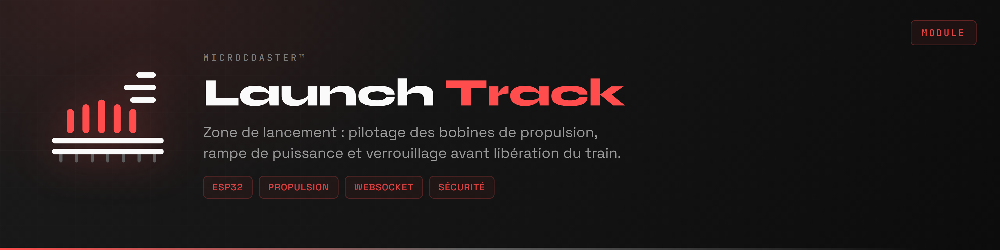
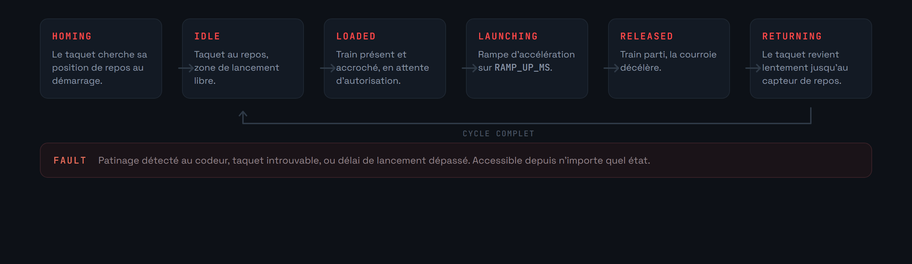
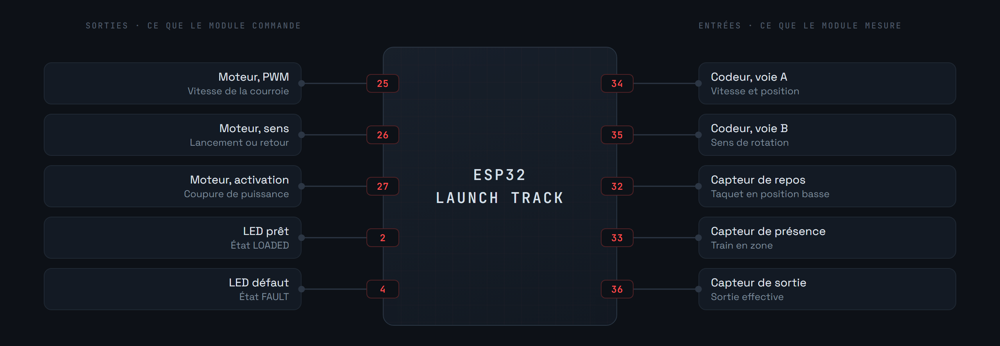
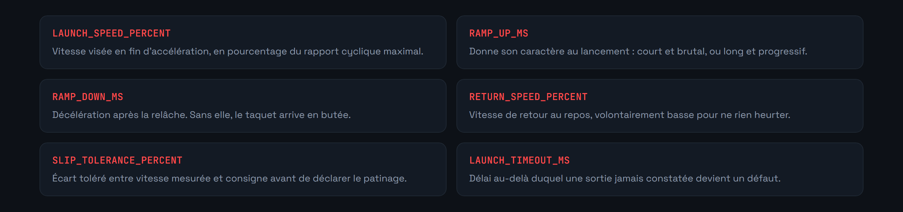

<div align="center">



</div>

La zone de lancement accélère le train sur quelques dizaines de centimètres, au lieu de le hisser en haut d'une montée. Un moteur entraîne une poulie, la poulie fait tourner une courroie dentée, et un taquet solidaire de cette courroie vient accrocher le train, l'emmène en accélérant, puis le relâche.

Le module pilote ce moteur, mesure la vitesse réelle de la courroie au codeur, et ramène le taquet à sa position de repos entre deux lancements.

Comme les autres modules, il se configure au premier démarrage par portail captif, puis rejoint le serveur en WebSocket.

**Version 0.1.0**


Tout tourne autour d'une question : le taquet est-il là où on croit, et entraîne-t-il vraiment le train ?

Un codeur sur l'arbre de la poulie répond aux deux. Il donne la vitesse de la courroie, ce qui permet de suivre la rampe d'accélération. Et il donne la position du taquet sur son parcours, ce qui permet de le ramener au repos après chaque lancement.



Le taquet ne revient pas en marche arrière brutale : la courroie décélère sur `RAMP_DOWN_MS`, puis repart lentement à `RETURN_SPEED_PERCENT` jusqu'au capteur de repos.


**Aucun lancement n'est décidé localement.** Le module exécute un ordre du contrôleur, qui seul sait si la voie en aval est dégagée.

**Le taquet doit être au repos avant d'accepter un train.** S'il ne l'est pas, il accrochera au mauvais endroit, ou pas du tout. C'est la raison d'être de l'état `HOMING` au démarrage.

**Deux délais bornent l'opération.** `LAUNCH_TIMEOUT_MS` déclare le défaut si la sortie n'est jamais constatée, `RETURN_TIMEOUT_MS` si le taquet ne retrouve pas sa position de repos.

**Le patinage coupe tout.** Si la vitesse mesurée au codeur s'écarte durablement de la consigne au-delà de `SLIP_TOLERANCE_PERCENT`, c'est que le taquet glisse sur le train au lieu de l'entraîner. Insister use la courroie, arrondit les dents, et finit par abîmer la pièce d'accroche du train.







Une rampe trop courte fait patiner le taquet ou force sur l'accroche. C'est le premier réglage à revoir si le lancement manque de tenue.


Copiez d'abord [`include/env.h.example`](include/env.h.example) en `include/env.h` et renseignez-le : identifiants du portail de secours, identité du module et son secret. Ce fichier n'est pas versionné, et sans lui le firmware ne compile pas.

Nécessite [PlatformIO](https://platformio.org/) dans Visual Studio Code.

```bash
pio run                  # compilation
pio run -t upload        # téléversement du firmware
pio run -t uploadfs      # téléversement du portail vers LittleFS
pio device monitor       # console série, 115200 bauds
```

1. Alimenter le module. Il crée un point d'accès WiFi.
2. S'y connecter et ouvrir `http://192.168.4.1`.
3. Renseigner le réseau de destination.
4. Le module redémarre, rejoint le réseau et s'annonce auprès du serveur.

Les identifiants restent en mémoire du module, jamais dans le dépôt.


Le brochage, les paramètres et la machine à états sont posés dans `src/main.cpp`. Restent à écrire la lecture du codeur sur interruption, l'asservissement de vitesse, la détection de patinage et la télémétrie.

Le socle commun à tous les modules est le [WiFi Manager](https://github.com/Microcoaster/MicroCoaster_WifiManager). L'autre manière de donner son énergie au train est le [Lift Hill](https://github.com/Microcoaster/Lift-Hill). Le pilotage se fait depuis la [WebApp](https://github.com/Microcoaster/MicroCoasterWebApp).

---

<sub>MicroCoaster · Auteur : Cybertrist</sub>
